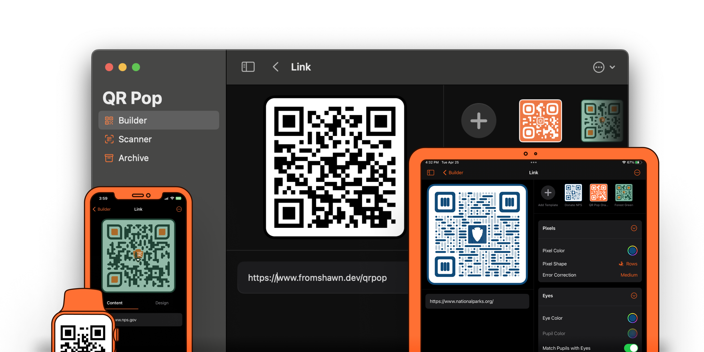

# QR Pop 

QR Pop is a clean, convenient, and privacy-first QR code generator for macOS and iOS. 

It is built primarily using **Swift UI** and utilizes a variety of system extensions to allow for the creation of QR codes in Safari, the Share Sheet, and the app itself.

QR Pop can generate codes for URLs, Wi-Fi Networks, Calendar Events, Contacts, Locations, and more. Codes can be exported as images or saved to CoreData/iCloud.

[Download Here](https://apps.apple.com/us/app/qr-pop/id1587360435?mt=12)

## Privacy 🕵️
QR Pop contains no logging or analytics packages and, in fact, does not perform any network requests at all. That being said, QR Pop does utilize CloudKit alongside CoreData. iCloud usage is optional and is subject to [Apple's Privacy Policy](https://www.apple.com/legal/privacy/en-ww/).

Likewise, the QR Pop Safari Extension does not contain a content script and does not read the content of any webpages. Like the main application, the QR Pop Safari Extension does not interface with any external servers and instead creates all codes on-device.

## Building this project 🛠️
1. Clone the Repo
2. Update the signing `Team` for each target.
3. Build

QR Pop uses the Swift Package Manager, so building is fairly straight forward.

## Features & Bugs 🐞
If you have an idea for a new feature, or have run into a bug, please file an Issue. Feature requests should be marked with `enhancement` while bugs should be marked with `bug`.

For bugs, please include detailed instructions to reproduce the issue.

Not all requested features will be added, but I do hope all reported bugs can be squashed.

## Acknowledgments 🤝
- QR Pop uses [QRCode](https://github.com/dagronf/QRCode) library to generate and stylize codes in the main application and some extensions.
- QR Pop uses [QRCode.js](https://github.com/davidshimjs/qrcodejs) to generate codes in the Safari Extension.
- Other packages used:
	- [Connections](https://github.com/SwiftUI-Plus/Connections)
	- [PagerTabStripView](https://github.com/xmartlabs/PagerTabStripView)

